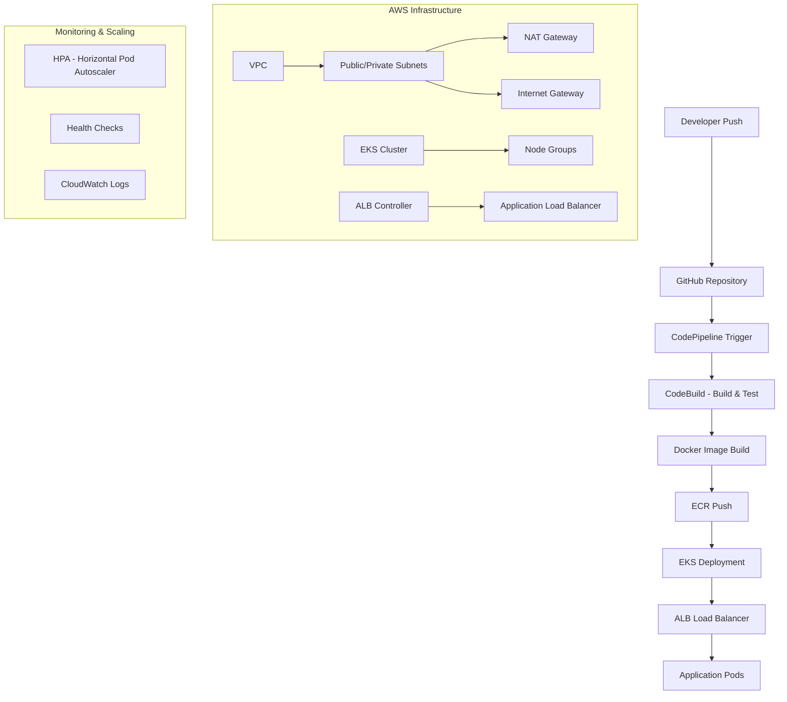

# DevSu DevOps Technical Test - Node.js Application

A comprehensive DevOps solution featuring a Node.js REST API with automated CI/CD pipeline, containerized deployment on AWS EKS, and infrastructure as code using Terraform.

## 🏗️ Architecture Overview



## 📁 Project Structure

```
.
├── app/                          # Node.js application
│   ├── health/                   # Health check endpoints
│   ├── shared/                   # Shared utilities
│   ├── users/                    # User management API
│   ├── index.js                  # Main application file
│   ├── package.json              # Dependencies
│   ├── Dockerfile                # Container configuration
│   └── buildspec.yaml            # CodeBuild specification
├── kubernetes/                   # Kubernetes manifests
│   ├── templates/                # Helm templates
│   ├── Chart.yaml                # Helm chart definition
│   ├── values-dev.yaml           # Development values
│   └── values-prod.yaml          # Production values
├── terraform/                    # Infrastructure as Code
│   ├── modules/                  # Terraform modules
│   │   ├── devsu/               # EKS and ECR resources
│   │   ├── network/             # VPC and networking
│   │   └── pipelines/           # CI/CD pipeline
│   └── main.tf                  # Root configuration
└── README.md                    # This file
```

## 🚀 Quick Start

### Prerequisites

-   AWS CLI configured with appropriate permissions
-   Terraform >= 1.0
-   Docker
-   kubectl
-   Helm 3.x
-   Node.js 18+ (for local development)

## 📦 Infrastructure Deployment

### 1. Deploy AWS Infrastructure with Terraform

```bash
# Navigate to terraform directory
cd terraform

# Initialize Terraform
terraform init

# Review the deployment plan
terraform plan

# Deploy infrastructure
terraform apply -auto-approve
```

This will create:

-   VPC with public/private subnets across 2 AZs
-   EKS cluster with managed node groups
-   ECR repository for container images
-   CodePipeline for CI/CD
-   IAM roles and policies
-   AWS Load Balancer Controller

### 2. Configure kubectl for EKS

```bash
# Update kubeconfig to connect to your EKS cluster
aws eks update-kubeconfig --region us-east-1 --name devsu-eks-cluster-devsu-prod

# Verify connection
kubectl get nodes
```

### 3. Verify AWS Load Balancer Controller

```bash
# Check if the controller is running
kubectl get deployment -n kube-system aws-load-balancer-controller

# Should show READY 2/2
```

## 🎯 Application Deployment with Helm

### 1. Deploy to Production

```bash
# From project root directory
helm install users ./kubernetes --values ./kubernetes/values-prod.yaml

# Or upgrade existing deployment
helm upgrade users ./kubernetes --values ./kubernetes/values-prod.yaml
```

### 2. Deploy to Development (Optional)

```bash
# Deploy development version
helm install users-dev ./kubernetes --values ./kubernetes/values-dev.yaml
```

### 3. Verify Deployment

```bash
# Check pods status
kubectl get pods

# Check services
kubectl get services

# Check ingress and get ALB URL
kubectl get ingress
```

### 4. Get Application URL

```bash
# Get the ALB endpoint
kubectl get ingress devsu-devops-technical-test-nodejs-ingress

# Example output:
# NAME                                         ADDRESS
# devsu-devops-technical-test-nodejs-ingress   k8s-default-devsudev-abc123.us-east-1.elb.amazonaws.com
```

## 🏃‍♂️ Running the Application

### Production Access

Once deployed, access your application at:

```
http://<ALB-ENDPOINT>/v1/api/users
```

### API Endpoints

| Method | Endpoint            | Description           |
| ------ | ------------------- | --------------------- |
| GET    | `/health`           | Health check endpoint |
| GET    | `/v1/api/users`     | Get all users         |
| GET    | `/v1/api/users/:id` | Get user by ID        |
| POST   | `/v1/api/users`     | Create new user       |

### Example Requests

```bash
# Health check
curl http://<ALB-ENDPOINT>/health

# Get all users
curl http://<ALB-ENDPOINT>/v1/api/users

# Create a new user
curl -X POST http://<ALB-ENDPOINT>/v1/api/users \
  -H "Content-Type: application/json" \
  -d '{"name": "John Doe", "dni": "12345678"}'

# Get specific user
curl http://<ALB-ENDPOINT>/v1/api/users/1
```

### Local Development

```bash
# Navigate to app directory
cd app

# Install dependencies
npm install

# Set environment variables
export NODE_ENV=development
export PORT=8000
export DATABASE_NAME=test.db

# Run the application
npm start

# Run tests
npm test

# Access locally
curl http://localhost:8000/health
```

## 🔄 CI/CD Pipeline

The automated pipeline includes:

### 1. Source Stage

-   Triggers on push to `main` branch
-   Pulls code from GitHub via CodeStar connection

### 2. Build Stage

-   Installs Node.js dependencies
-   Runs unit tests
-   Builds Docker image
-   Pushes to ECR
-   Generates deployment artifacts

### 3. Deploy Stage (Manual trigger recommended)

-   Updates Kubernetes deployment
-   Performs rolling updates with zero downtime

### Pipeline Configuration

The pipeline is configured to:

-   ✅ Run automated tests
-   ✅ Build and push container images
-   ✅ Generate deployment artifacts
-   ✅ Support multiple environments

## 📊 Monitoring and Scaling

### Horizontal Pod Autoscaler (HPA)

The application automatically scales based on:

-   **CPU**: Scales when average CPU > 70%
-   **Memory**: Scales when average memory > 80%
-   **Range**: 2-10 pods

```bash
# Check HPA status
kubectl get hpa

# View HPA details
kubectl describe hpa devsu-devops-technical-test-nodejs-hpa
```

### Health Monitoring

-   **Liveness Probe**: `/health` endpoint every 10 seconds
-   **Readiness Probe**: `/health` endpoint every 5 seconds
-   **Initial Delay**: 30 seconds for liveness, 5 seconds for readiness

### Logs

```bash
# View application logs
kubectl logs -l app=devsu-devops-technical-test-nodejs

# Follow logs
kubectl logs -f deployment/devsu-devops-technical-test-nodejs-deployment-production
```

## 🛠️ Management Commands

### Helm Operations

```bash
# List releases
helm list

# Check deployment status
helm status users

# Rollback to previous version
helm rollback users

# Uninstall application
helm uninstall users
```

### Kubernetes Operations

```bash
# Scale manually
kubectl scale deployment devsu-devops-technical-test-nodejs-deployment-production --replicas=5

# Get pod details
kubectl describe pod <pod-name>

# Access pod shell
kubectl exec -it <pod-name> -- /bin/sh

# Port forward for debugging
kubectl port-forward service/devsu-devops-technical-test-nodejs-service 8080:80
```

### Terraform Operations

```bash
# Check infrastructure status
terraform show

# Update infrastructure
terraform plan
terraform apply

# Destroy infrastructure
terraform destroy
```

## 🔧 Configuration

### Environment Variables

| Variable            | Description       | Default                |
| ------------------- | ----------------- | ---------------------- |
| `NODE_ENV`          | Environment mode  | `production`           |
| `PORT`              | Application port  | `8000`                 |
| `DATABASE_NAME`     | Database name     | `devsu_db`             |
| `DATABASE_USER`     | Database user     | `admin`                |
| `DATABASE_PASSWORD` | Database password | From Kubernetes secret |

### Helm Values

Customize deployment via `values-prod.yaml`:

-   Replica count
-   Resource limits
-   Environment variables
-   Container image

## 🚨 Troubleshooting

### Common Issues

1. **ALB not created**: Check ingress annotations and AWS Load Balancer Controller logs
2. **Pods not starting**: Check resource limits and node capacity
3. **Pipeline fails**: Verify IAM permissions and CodeBuild logs
4. **Health checks failing**: Ensure `/health` endpoint is accessible

### Debug Commands

```bash
# Check ingress controller logs
kubectl logs -n kube-system deployment/aws-load-balancer-controller

# Check pod events
kubectl get events --sort-by=.metadata.creationTimestamp

# Describe problematic resources
kubectl describe pod <pod-name>
kubectl describe ingress <ingress-name>
```

## 📚 Additional Resources

-   [AWS EKS Documentation](https://docs.aws.amazon.com/eks/)
-   [Helm Documentation](https://helm.sh/docs/)
-   [Terraform AWS Provider](https://registry.terraform.io/providers/hashicorp/aws/latest/docs)
-   [AWS Load Balancer Controller](https://kubernetes-sigs.github.io/aws-load-balancer-controller/)

## 🤝 Contributing

1. Fork the repository
2. Create a feature branch
3. Make your changes
4. Run tests: `npm test`
5. Create a pull request

## 📄 License

This project is licensed under the MIT License.

---

**Note**: This is a technical test project demonstrating DevOps best practices including Infrastructure as Code, containerization, orchestration, and automated CI/CD pipelines.
